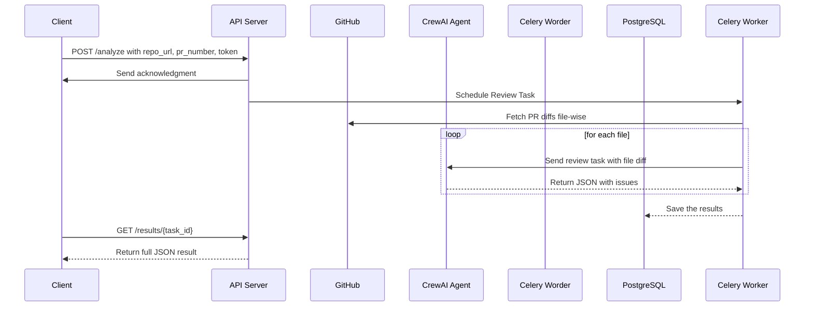

# Code Review Agent 

## Project Overview

This project is an automated **AI-powered code review agent** that takes a GitHub Pull Request (PR), fetches the diff file-by-file, and analyzes each file using a specialized CrewAI agent to detect issues such as bugs, styling problems, performance flaws, and best practice violations. The final result is a downloadable, structured JSON or PDF report.

---

## How It Works (Agent Flow)

1. **API Input**:  
   User sends a `POST` request to `/analyze` with:
   - GitHub repo URL
   - PR number
   - GitHub token (for authentication)

2. **Fetching Diff**:  
   The agent fetches diffs for all files in the specified PR using GitHub’s API.

3. **CrewAI Agent Task**:
   - For each file, a prompt is built including the file name and diff.
   - A CrewAI agent (GPT-4.1-mini) analyzes the diff based on the prompt.
   - The agent returns only JSON, listing any code issues found.

4. **Result Aggregation**:  
   All file-wise issues are collected. A task summary is generated, including total files, total issues, and critical issues (bugs).

5. **Storing & Retrieving Results**:
   - Results are saved to a PostgreSQL database
   - Users can fetch results using `/results/<task_id>`.
   - The results can also be visualized and downloaded in Gradio UI by giving the Task ID

---

## Tech Stack

| Tech        | Description                          |
|-------------|--------------------------------------|
| **Python**  | Backend language                     |
| **FastAPI** | Web framework for API                |
| **CrewAI**  | Multi-agent orchestration framework  |
| **OpenAI GPT-4.1-mini** | LLM used in code review tasks |
| **GitHub API** | For fetching PR diffs             |
| **Docker** | Containerisation and Deployment             |

---

## API Documentation

### 1. Analyze PR

```http
POST /analyze
Content-Type: application/json
````

**Request Body**:

```json
{
  "repo_url": "https://github.com/your-org/your-repo",
  "pr_number": 42,
  "token": "ghp_XXXXXXXXXX"
}
```

**Response**:

```json
{
  "task_id": "9a7f1d02-xxxx-xxxx-xxxx-31d7ea123456",
  "message": "Review started in background"
}
```

---

### 2. Get JSON Results

```http
GET /results/{task_id}
```

Returns the full JSON review results for the given task ID as follows

```json
{
  "name": "app.py",
  "issues": [
    {
      "type": "bug",
      "line": 24,
      "description": "Potential NoneType error if user is not found.",
      "suggestion": "Add a check for user existence before accessing properties."
    },
    {
      "type": "style",
      "line": 45,
      "description": "Line too long (exceeds 120 characters).",
      "suggestion": "Split the line for better readability."
    }
  ]
}
```

---

## Sequence Diagram



---

## Environment Variables

Create a `.env` file with:

```
OPENAI_API_KEY=your-openai-api-key
```

---

## Setup Instructions

### Non-dockerized

1. Clone the repo
2. Install dependencies:

   ```bash
   pip install -r requirements.txt
   ```
3. Set environment variables or `.env`
4. Run the server:

   ```bash
   uvicorn main:app --host 0.0.0.0 --port 8000 --reload
   ```

### Dockerised

1. Clone the repo
2. Run the containers:

    ```bash
   sudo docker compose up -d --build
   ```

